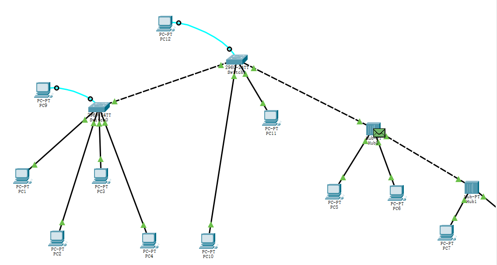

# 一.共享式网络中的传递过程

## 共享式网路结构

由两台pc机与一个集线器相连接，然后两个这样的结构通过集线器级联，形成多集线器共享式以太网组网。

pc0-ip：192.168.0.1

pc1-ip：192.168.0.2

pc2-ip：192.168.0.3

pc3-ip：192.168.0.4

## 拟真数据包传递

### pc0发送数据包
尝试使用**pc0**（192.168.0.1）ping **pc3**（192.168.0.4）。

查看数据包，可以看到数据包的源地址是**pc0**（192.168.0.1），目的地址是**pc3**（192.168.0.4）。

### 集线器Hub0接受到数据包

查看Hub0处的数据包，同样可以查看到源地址和目标地址。

### 集线器Hub0广播数据包

因为是共享式网络，所以会广播接收到的数据包。但是由于PC1并不是目的地址，所以PC1处会拒绝接收。

### 集线器Hub1广播数据包

当集线器Hub1接收到数据包以后，会进行广播，讲数据包传递到PC2和PC3中，但是只有PC3才是目的地址，所以只有PC3会接收。

### PC3接收数据包之后

PC3接收数据包之后，向PC1发送数据包，此时数据包的源地址为pc3（192.168.0.4），目的地址为pc0（192.168.0.1）。

### 集线器2接收数据包之后广播

因为PC3并不是目的地址，所以不会接收。

### 接线器1接收数据包后广播

PC0成功接收。

# 二.交换式以太网组网和VLAN配置

## 单台交换机中划分VLAN

### 网络结构

### vlan划分

myVLAN10:PC0（192.168.0.1）,PC3（192.168.0.3）,PC5（192.168.0.5）

myVLAN20:PC1（192.168.0.2）,PC4（192.168.0.4）,PC6（192.168.0.6）

### 检查连接性

#### PC0 PING PC3 —— 同一VLAN中

在同一个VLAN中，所有主机共享相同的广播域，可以直接相互通信。

#### PC0 PING PC1 —— 不同VLAN中

不同VLAN之间通常会被隔离成不同的广播域，无法直接相互通信。这种隔离可以提高网络的安全性和管理性。如果需要不同VLAN中实现通信，那么通常需要一个路由器或者三层交换机来实现。

## 多集线器、多交换机混合式网络划分VLAN

#### 网络结构

#### vlan划分

交换机1：

交换机2：

myvlan10：PC1，PC3，PC11

myvlan20：PC2，PC4，PC10，PC5，PC6，PC7，PC8

#### PC5 PING PC6 —— 连接同一集线器

#### PC5 PING PC7 —— 两个集线器级联

#### PC5PING PC1 —— 不同VLAN

#### PC5PING PC2 —— 同一VLAN

##### 

我们在划分VLAN时，将交换机1的某些端口和交换机2的某些端口设置为同一个VLAN，而其他端口设置为不同的VLAN。使得同一VLAN中的设备在逻辑上被视为位于同一个广播域，因此它们能够直接相互通信，而划分到不同VLAN的设备之间不能直接通信。

## 混合式以太网、虚拟局域网中的传递过程

#### PC5 PING PC6 —— 连接同一集线器

如实验一所示

#### PC5 PING PC7 —— 两个集线器级联

如实验一所示

#### PC5PING PC1 —— 不同VLAN

##### PC5发送数据包

源地址PC5（192.168.0.5），目的地址PC1（192.168.0.1）

##### 传送集线器1

集线器1进行广播

##### 交换机1接收到数据包

因为交换机1中并没有储存PC1的ip地址，所以会进行广播。

##### 交换机2接收到数据包

同样进行广播

发送不到PC1处。

#### PC5PING PC2 —— 同一VLAN

前面和ping PC1一样

##### 在交换机1处会直接将数据包传送到PC2处（如果传递过一次的话），也可能会进行广播（如果式第一次传送，交换机1中没有储存PC2的ip）。

之后就会返回PC5，完成ping操作。

