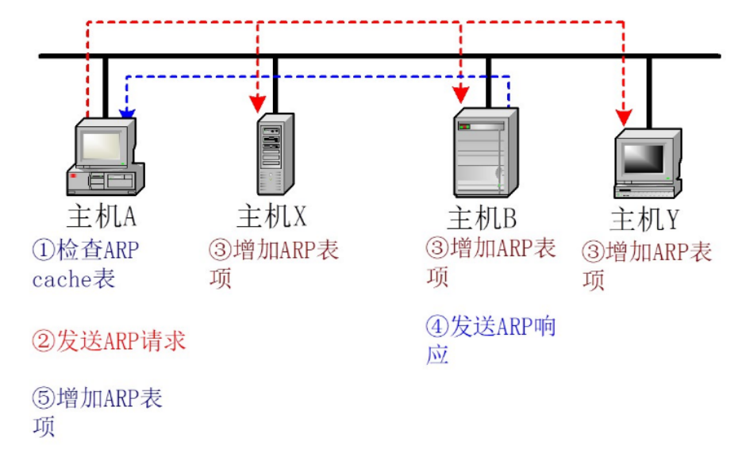
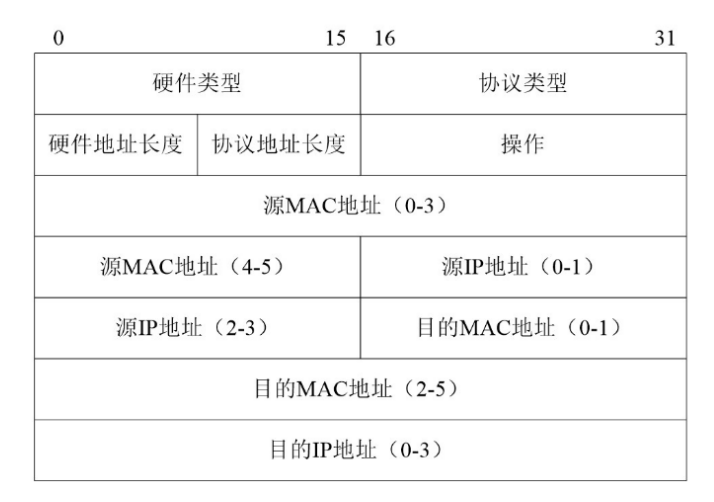
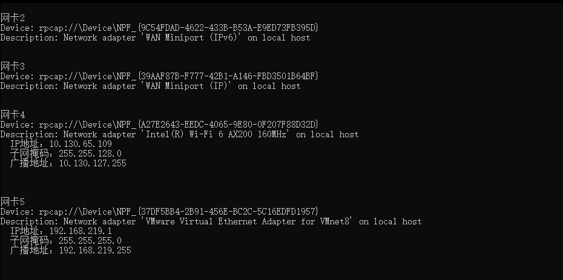
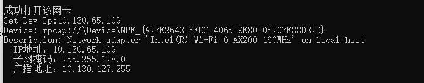
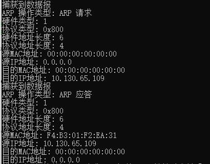
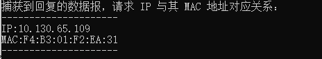
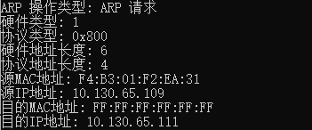
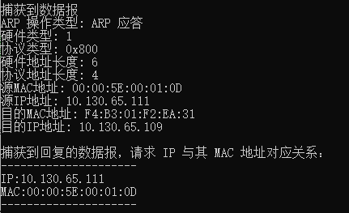

# 实验 3：通过编程获取 IP 地址与 MAC 地址 的对应关系

## 实验要求

通过编程获取 IP 地址与 MAC 地址的对应关系实验，要求

（1）在IP数据报捕获与分析编程实验的基础上，学习NPcap的数据包发送方法。

（2）通过NPcap编程，获取IP地址与MAC地址的映射关系。

（3）程序要具有输入IP地址，显示输入IP地址与获取的MAC地址对应关系界面。界面可以是命令行界面，也可以是图形界面，但应以简单明了的方式在屏幕上显示。

（4）编写的程序应结构清晰，具有较好的可读性。

## 实验原理

### 1.Npcap捕获数据包

- 设备列表获取方法：

  NpCap 提供了pcap_findalldevs 函数来获取计算机上的网络接口设备的列表；此函数会为传入的 pcap_if_t 赋值（该类型是一个表示了设备列表的链表头；每一个这样的节点都包含了 name 和 description 域来描述设备）。

  ```
  int pcap_findalldevs_ex(
  	char * source;      //指定从哪儿获取网络接口列表
  	struct pcap_rmauth auth;    //用于验证，由于是本机，置为NULL
  	pcap_if_t ** alldevs;       //当该函数成功返回时，alldevs指向获取的列表数组的第一个
  								//列表中每一个元素都是一个pcap_if_t结构
  	char * errbuf               //错误信息缓冲区
  )
  ```

- 打开网络接口方法：

  NpCap 提供了pcap_open 函数于获取数据包捕获句柄以查看网络上的数据包。

  ```
  pcap_t * pcap_open(
  	const char *source;             //要打开的网卡的名字
  	int snaplen,
  	int flags,                      //指定以何种方式打开网卡，常用的有混杂模式
  	int read_timeout,               //数据包捕获函数等待一个数据包的最大时间，超时则返回0
  	struct pcap_rmauth *auth,
  	char *errbuf
  )
  ```

- 数据报捕获方法：

  Npcap提供了 pcap_next_ex 函数。

  ```
  int pcap_next_ex(
  	pcap_t *p,//当为调用pcap_open()成功之后返回的值，它指定了捕获哪块网卡上的数据包
  	struct pcap_pkthdr ** pkt_header,//捕获该数据包的时间戳、数据包的长度等等信息
  	u_char ** pkt_data//捕获到的网络数据包
  )
  ```

- 数据报发送方法：

  Npcap提供了pcap_sendpacket函数。

  ```
  int pcap_sendpacket(
  	pcap_t *p,// 一个已经打开的 pcap 句柄，表示一个网络适配器
      const u_char *buf,// 一个指向待发送数据包的缓冲区的指针
      int size// 待发送数据包的长度
  );
  
  ```

### 2.ARP 的基本思想

ARP（Address Resolution Protocol）是一种用于解析网络层地址和链路层地址之间关系的协议。它的基本思想是将网络层地址（通常是IP地址）映射到链路层地址（通常是MAC地址）。

ARP根据IP地址获取物理地址的一个TCP/IP协 议。主机发送信息时将包含目标IP地址的ARP请求广播到局域网络上的所有主机，并接收返回消息，以 此确定目标的物理地址；收到返回消息后将该IP地址和物理地址存入本机ARP缓存中并保留一定时间， 下次请求时直接查询ARP缓存以节约资源。地址解析协议是建立在网络中各个主机互相信任的基础上 的，局域网络上的主机可以自主发送ARP应答消息，其他主机收到应答报文时不会检测该报文的真实性 就会将其记入本机ARP缓存。

**ARP的基本工作原理如下**：

1. **ARP请求：** 当设备A需要知道设备B的MAC地址时，设备A会在本地网络广播一个ARP请求，询问“谁拥有这个IP地址？”。
2. **ARP应答：** 设备B收到ARP请求后，会向设备A直接发送ARP应答，包含自己的MAC地址。
3. **ARP缓存：** 设备A收到ARP应答后，会将设备B的IP地址和MAC地址的映射关系存储在本地的ARP缓存中，以便将来的通信。
4. **ARP缓存定时过期：** ARP缓存中的映射关系是有时效性的，因为设备的网络连接可能会变化。因此，ARP缓存中的条目会有一个定时器，当超过一定时间后，会自动删除。

**ARP的基本工作流程如下**：



**ARP的报文格式程如下**：



- **硬件类型（Hardware Type）：** 16位字段，定义运行 ARP 的网络类型。例如，以太网的类型为1。ARP 可在任何物理网络上使用。
- **协议类型（Protocol Type）：** 16位字段，定义使用的网络层协议。例如，对于 IPv4 协议，该字段是 0x0800。ARP 可用于任何高层协议。
- **硬件地址长度（Hardware Address Length）：** 8位字段，定义 MAC 地址的长度，以字节为单位。例如，对于以太网，该值为6。
- **协议地址长度（Protocol Address Length）：** 8位字段，定义 IP 地址的长度，以字节为单位。例如，对于 IPv4 协议，该值为4。
- **操作（Operation）：** 16位字段，定义报文的类型。已定义的分组类型有两种：ARP请求（0x0001）和 ARP响应（0x0002）。
- **源 MAC 地址（Sender Hardware Address）：** 这是一个可变长度字段，用于定义发送方的 MAC 地址。例如，对于以太网，该字段长度为6字节。
- **源 IP 地址（Sender Protocol Address）：** 这是一个可变长度字段，用于定义发送方的 IP 地址。例如，对于 IPv4 协议，该字段长度为4字节。
- **目的 MAC 地址（Target Hardware Address）：** 这是一个可变长度字段。在 ARP 请求中，该字段没有意义；在 ARP 响应中，该字段表示接收方的 MAC 地址。例如，对于以太网，该字段长度为6字节。在 ARP 请求中，该字段为全0，表示发送方不知道目标的 MAC 地址。在 ARP 请求中，该字段为全1，表示广播地址。
- **目的 IP 地址（Target Protocol Address）：** 在 ARP 请求中，该字段表示要解析的目标 IP 地址；在 ARP 响应中，该字段表示接收方的 IP 地址。

## 代码编写

### ARP报文格式设计

```
//14字节以太网首部
typedef struct EthernetHeader
{
	u_char DestMAC[6];    // 目的MAC地址6字节
	u_char SrcMAC[6];    // 源MAC地址 6字节
	u_short EthType;      // 上一层协议类型，如0x0800代表上一层是IP协议，0x0806为arp  2字节
}EthernetHeader;

//28字节ARP帧结构
typedef struct ArpHeader
{
	unsigned short HdType;    // 硬件类型
	unsigned short ProType;   // 协议类型
	unsigned char HdSize;     // 硬件地址长度
	unsigned char ProSize;    // 协议地址长度
	unsigned short OP;        // 操作类型，ARP请求(1)，ARP应答(2)，RARP请求(3)，RARP应答(4)。
	u_char SrcMac[6];           // 源MAC地址
	u_char SrcIp[4];            // 源IP地址
	u_char DestMac[6];           // 目的MAC地址
	u_char DestIp[4];            // 目的IP地址
}ArpHeader;

//定义整个arp报文包，总长度42字节
struct ArpPacket {
	EthernetHeader *ed;
	ArpHeader *ah;
};
```

### ARP数据包初始和打印

```
void BuildArpRequest(EthernetHeader *eh, ArpHeader *ah, u_char *sendbuf, const u_char *src_ip, const u_char *dest_ip) {
	// 开始填充ARP包
	memset(eh->DestMAC, 0xff, 6);      // 以太网首部目的MAC地址,全为广播地址
	memset(eh->SrcMAC, 0x0f, 6);      // 以太网首部源MAC地址
	//memcpy(eh->SrcMAC, src_mac, 6);   // 以太网首部源MAC地址
	memset(ah->SrcMac, 0x00, 6);      // ARP字段源MAC地址
	memset(ah->DestMac, 0x00, 6);         // ARP字段目的MAC地址
	memcpy(ah->SrcIp, src_ip, 4);        // ARP字段源IP地址
	memcpy(ah->DestIp, dest_ip, 4);          // ARP字段目的IP地址

	// 赋值MAC地址
	eh->EthType = htons(ETH_ARP);   //htons：将主机的无符号短整形数转换成网络字节顺序
	ah->HdType = htons(ARP_HARDWARE);
	ah->ProType = htons(ETH_IP);
	ah->HdSize = 6;
	ah->ProSize = 4;
	ah->OP = htons(ARP_REQUEST);

	// 构造一个ARP请求
	memset(sendbuf, 0, sizeof(sendbuf));            // ARP清零
	memcpy(sendbuf, eh, sizeof(*eh));               // 首先把eh以太网结构填充上
	memcpy(sendbuf + sizeof(*eh), ah, sizeof(*ah));  // 接着在eh后面填充arp结构
}

void PrintArpHeader(const u_char * packetData) {
	struct EthernetHeader *eth_protocol;
	eth_protocol = (struct EthernetHeader *)packetData;

	if (ntohs(eth_protocol->EthType) == 0x0806) {  // 检查是否是 ARP 协议
		struct ArpHeader *arp_protocol;
		arp_protocol = (struct ArpHeader *)(packetData + sizeof(struct EthernetHeader));

		printf("ARP 操作类型: %s\n", ntohs(arp_protocol->OP) == 1 ? "ARP 请求" : "ARP 应答");
		printf("硬件类型: %u\n", ntohs(arp_protocol->HdType));
		printf("协议类型: 0x%x\n", ntohs(arp_protocol->ProType));
		printf("硬件地址长度: %u\n", arp_protocol->HdSize);
		printf("协议地址长度: %u\n", arp_protocol->ProSize);

		printf("源MAC地址: %02X:%02X:%02X:%02X:%02X:%02X\n",
			arp_protocol->SrcMac[0], arp_protocol->SrcMac[1], arp_protocol->SrcMac[2],
			arp_protocol->SrcMac[3], arp_protocol->SrcMac[4], arp_protocol->SrcMac[5]);

		printf("源IP地址: %u.%u.%u.%u\n",
			arp_protocol->SrcIp[0], arp_protocol->SrcIp[1], arp_protocol->SrcIp[2], arp_protocol->SrcIp[3]);

		printf("目的MAC地址: %02X:%02X:%02X:%02X:%02X:%02X\n",
			arp_protocol->DestMac[0], arp_protocol->DestMac[1], arp_protocol->DestMac[2],
			arp_protocol->DestMac[3], arp_protocol->DestMac[4], arp_protocol->DestMac[5]);

		printf("目的IP地址: %u.%u.%u.%u\n",
			arp_protocol->DestIp[0], arp_protocol->DestIp[1], arp_protocol->DestIp[2], arp_protocol->DestIp[3]);
	}
	else {
		printf("不是 ARP 协议\n");
	}
}
```


### 打印所有设备信息

```
void DisplayDevs() {

	pcap_if_t *alldevs;//设备链表
	pcap_if_t *d;//用于遍历
	char errbuf[PCAP_ERRBUF_SIZE];

	if (pcap_findalldevs_ex(PCAP_SRC_IF_STRING, NULL, &alldevs, errbuf) == -1) {
		fprintf(stderr, "Error in pcap_findalldevs_ex: %s\n", errbuf);
		return;
	}

	int i = 0, inum;

	// 显示所有检测到的设备
	pcap_addr_t* a;
	for (d = alldevs; d != NULL; d = d->next) {
		printf("\n");
		printf("网卡%d\n", ++i);
		PrintDevInfo(d);
	}
	if (i == 0) {
		printf("No interfaces found! Make sure Npcap is installed.\n");
		return;
	}
	pcap_freealldevs(alldevs);
}
```

### 打开指定网卡

```
pcap_t* OpenPcap(int nChoose, pcap_if_t** ptr) {
	pcap_t* pcap_handle;
	pcap_if_t* alldevs;
	char errbuf[PCAP_ERRBUF_SIZE];

	// 获取到所有设备列表
	if (pcap_findalldevs_ex(PCAP_SRC_IF_STRING, NULL, &alldevs, errbuf) == -1)
		exit(0);

	// 找到指定的网卡设备
	for (int x = 0; x < nChoose - 1; ++x)
		alldevs = alldevs->next;

	*ptr = alldevs; // 修改指针的值

	PrintDevInfo(*ptr);

	if ((pcap_handle = pcap_open((*ptr)->name,  // 设备名
		65536,         // 每个包长度
		PCAP_OPENFLAG_PROMISCUOUS,  // 混杂模式
		1000,          // 读取超时时间
		NULL,          // 远程机器验证
		errbuf         // 错误缓冲池
	)) == NULL) {
		pcap_freealldevs(alldevs);
		exit(0);
	}

	printf("成功打开该网卡\n");
	return pcap_handle;
}
```

### 向指定网卡发送ARP请求数据包

```
bool SendArpRequestSelf(pcap_t *handle, const u_char *src_ip, const u_char *dest_ip, u_char *SendIp, u_char *SendMac) {
	EthernetHeader eh;
	ArpHeader ah;
	unsigned char sendbuf[42];
	pcap_pkthdr *Packet_Header;
	const u_char *Packet_Data;
	char errbuf[PCAP_ERRBUF_SIZE];//错误信息缓冲区

	BuildArpRequest(&eh, &ah, sendbuf, src_ip, dest_ip);
	// 发送 ARP 请求包
	if (pcap_sendpacket(handle, sendbuf, 42) == 0) {
		printf("发送ARP请求成功!\n");
	}

	printf("捕获 ARP 响应!\n");
	return CapArpPacket(handle, src_ip, dest_ip, SendIp, SendMac);

	return false;
}
```

### 监听并接受ARP响应数据包

```
bool CapArpPacket(pcap_t *handle, const u_char *src_ip, const u_char *dest_ip, u_char *SendIp, u_char *SendMac) {
	printf("捕获 ARP 响应!\n");
	pcap_pkthdr *Packet_Header;
	const u_char *Packet_Data;
	char errbuf[PCAP_ERRBUF_SIZE];//错误信息缓冲区

	while (true) {
		int n = pcap_next_ex(handle, &Packet_Header, &Packet_Data);
		if (n == -1)
		{
			printf("捕获数据包时发生错误：%d\n", errbuf);
			return false;
		}
		else
		{
			if (n == 0)
			{
				printf("没有捕获到数据报\n");
			}

			else
			{
				printf("捕获到数据报\n");
				ArpPacket *IPPacket = (ArpPacket*)Packet_Data;
				PrintArpHeader(Packet_Data);
				struct ArpHeader *arp_protocol;
				arp_protocol = (struct ArpHeader *)(Packet_Data + sizeof(struct EthernetHeader));
				if (CompareIP(arp_protocol->DestIp, src_ip) && CompareIP(arp_protocol->SrcIp, dest_ip))
				{
					printf("捕获到回复的数据报，请求 IP 与其 MAC 地址对应关系：\n");
					printf("---------------------\n");
					printf("IP:");
					PrintIp(arp_protocol->SrcIp);
					printf("MAC:");
					PrintMac(arp_protocol->SrcMac);
					printf("---------------------\n");
					printf("\n");

					u_char* a;
					int i = 0;
					if (SendIp != NULL) {
						// 复制 arp_protocol->SrcIp 到 SendIp
						for (int j = 0; j < 4; ++j) {
							SendIp[i++] = arp_protocol->SrcIp[j];
						}

						// 复制 arp_protocol->SrcMac 到 SendMac
						for (int j = 0; j < 6; ++j) {
							SendMac[j] = arp_protocol->SrcMac[j];
						}
					}
					break;
				}
			}
		}
	}
	return true;
}
```

## 实验结果展示

### 打印所有设备信息



### 打开指定网卡



### 向打开的网卡发送ARP请求数据包和接受ARP响应数据包



### 得到并输出该网卡的IP与MAC地址对应关系



### 向其他IP地址发送ARP请求数据包



### 捕获ARP响应数据包得到并输出IP与MAC地址对应关系

